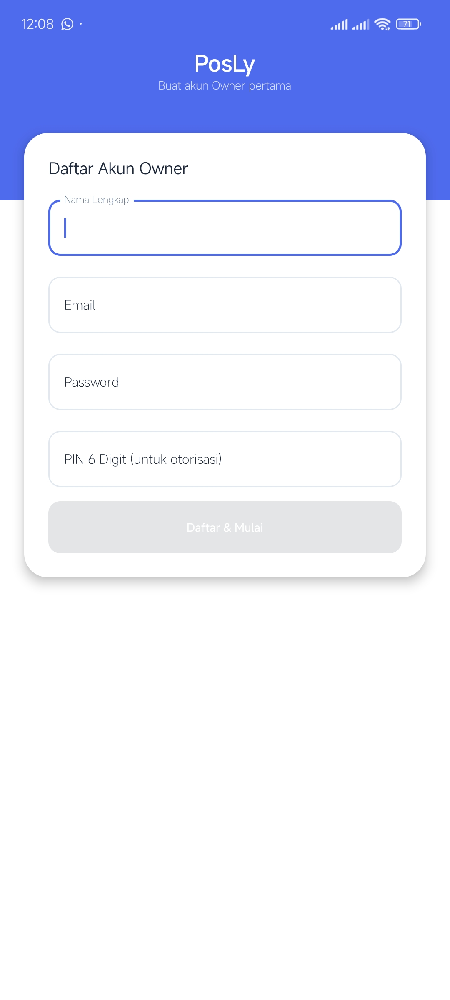
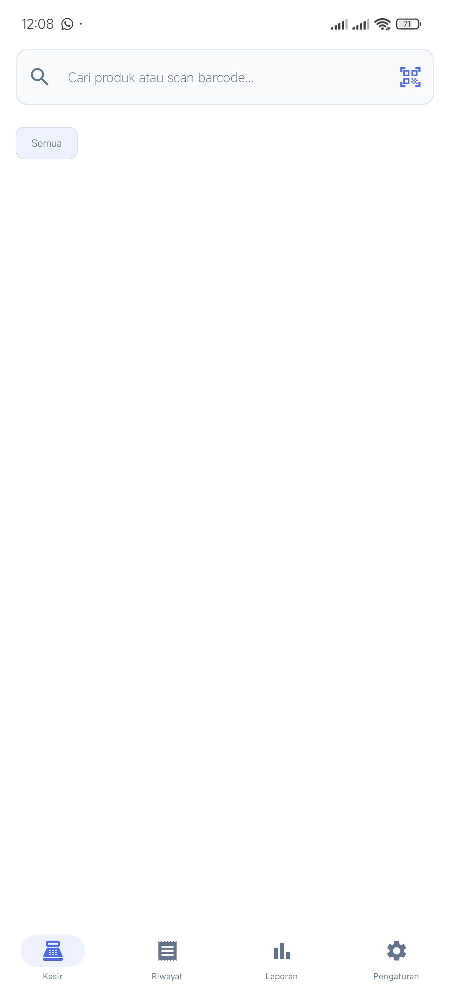
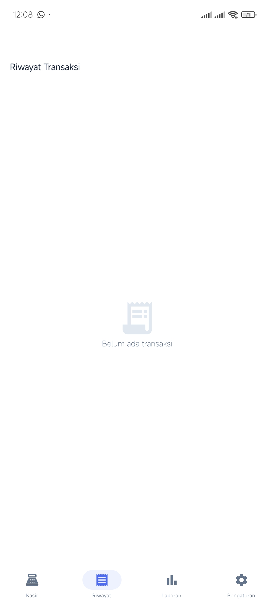
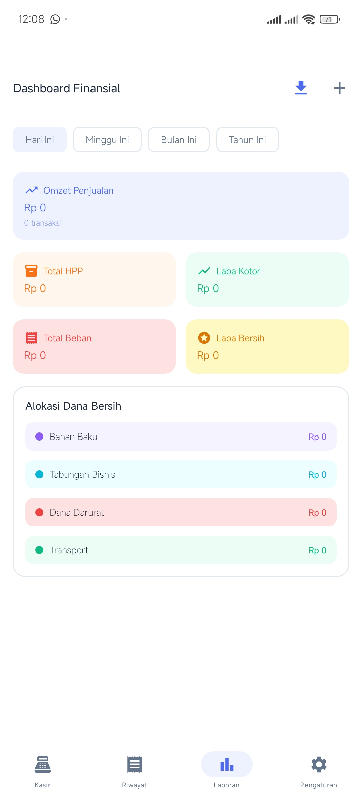
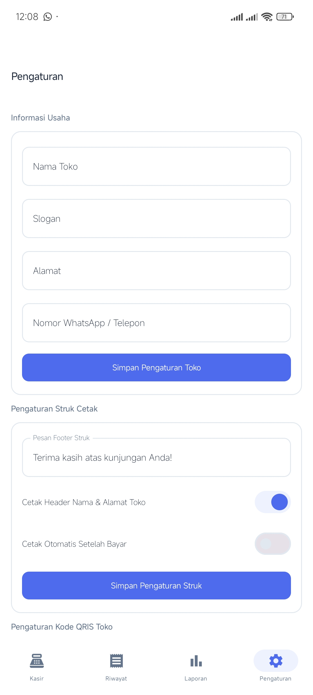

# PosLy 🏪

> **Aplikasi Kasir & Manajemen Finansial Modern untuk UMKM**  
> Native Android (Kotlin + Jetpack Compose) — *Offline-First, Realtime Sync, & Automated Budget Allocation*

[](https://android.com)
[](https://kotlinlang.org)
[](https://developer.android.com/jetpack/compose)
[](https://developer.android.com/topic/architecture)
[](https://supabase.com)
[](LICENSE)

---

## 📸 Tampilan Aplikasi

<div align="center">
  <table>
    <tr>
      <td align="center" width="33%">
        <b>1. Akun Owner</b><br/><br/>
        
      </td>
      <td align="center" width="33%">
        <b>2. Layar Kasir (POS)</b><br/><br/>
        
      </td>
      <td align="center" width="33%">
        <b>3. Riwayat Transaksi</b><br/><br/>
        
      </td>
    </tr>
    <tr>
      <td align="center" width="33%">
        <b>4. Laporan Finansial</b><br/><br/>
        
      </td>
      <td align="center" width="33%">
        <b>5. Pengaturan Toko & QRIS</b><br/><br/>
        
      </td>
      <td align="center" width="33%">
        <b>Multi-Device Support</b><br/><br/>
        <p>📱 Mobile Phone (Single Pane)<br/>📐 Tablet & POS Terminal (Split Pane)</p>
      </td>
    </tr>
  </table>
</div>

---

## ✨ Fitur Utama

- 🛒 **POS Kasir Adaptif** — Tampilan otomatis menyesuaikan perangkat (Single-pane pada ponsel, Split-pane katalog & keranjang pada tablet 840dp+).
- 📷 **Scan Barcode Kamera Native** — Pemindaian barcode produk menggunakan kamera Android langsung berbasis ML Kit Barcode Scanning.
- 🖼️ **Manajemen Produk & Foto** — Upload foto produk dari Galeri HP/Tablet atau foto langsung via Kamera. Pencatatan HPP, harga jual, perhitungan persentase margin otomatis, serta notifikasi stok minimum.
- 📊 **Laporan Finansial & Budget Allocation Engine** — Perhitungan otomatis Omzet, HPP, Laba Kotor, Laba Bersih, dan fitur pembagian alokasi kas usaha (30% Tabungan, 20% Darurat, 35% Restock, 15% Operasional).
- 💳 **Pembayaran Tunai & QRIS** — Perhitungan nominal pembayaran & kembalian otomatis, serta integrasi foto QRIS toko dari galeri.
- 🖨️ **Cetak Struk Thermal (ESC/POS)** — Kompatibel dengan printer Bluetooth & Wi-Fi TCP/IP (ukuran 58mm / 80mm) dengan pesan footer & header toko yang dapat dikustomisasi.
- 🔄 **Offline-First & Auto Sync** — Beroperasi penuh tanpa koneksi internet menggunakan SQLite (Room DB) terenkripsi lokal dan otomatis melakukan sinkronisasi ke Supabase saat terhubung ke jaringan via WorkManager.
- 🔐 **Keamanan & Kontrol Hak Akses (RBAC)** — Pemisahan peran Owner dan Kasir (Worker). Transaksi void/pembatalan memerlukan konfirmasi PIN milik Owner.
- 📁 **Ekspor Laporan Excel (.xlsx)** — Ekspor data penjualan & keuangan ke format file Excel dengan rumus aktif via Apache POI.

---

## 🏗️ Arsitektur & Teknologi

Aplikasi dibangun menggunakan prinsip **Clean Architecture** berbasis Android Modern Development (MAD):

```text
com.posly.app/
├── data/
│   ├── local/        # Room Database, DAO, & Encrypted Preferences
│   ├── remote/       # Supabase Client Provider & API Service
│   └── repository/   # Repository Implementations
├── domain/
│   ├── model/        # Core Business Entities (Product, Order, StoreSettings, etc.)
│   ├── repository/   # Repository Interfaces
│   └── usecase/      # Business Use Cases (ProcessPayment, VoidOrder, Finance, etc.)
└── presentation/
    ├── auth/         # Login, Register, Splash
    ├── pos/          # Kasir, Search, Scanner, Cart, Checkout
    ├── products/     # Katalog & Form Produk
    ├── orders/       # Riwayat & Void Transaksi
    ├── finance/      # Dashboard Laporan & Alokasi Dana
    └── settings/     # Pengaturan Toko, Struk, QRIS, & User
```

### Tech Stack

| Layer | Komponen & Library |
|---|---|
| **UI Framework** | Jetpack Compose + Material Design 3 |
| **Architecture** | Clean Architecture, MVVM + MVI, StateFlow, Kotlin Coroutines |
| **Dependency Injection** | Dagger Hilt |
| **Local Database** | Room DB + SQLCipher (Encrypted SQLite) |
| **Remote Backend** | Supabase (PostgreSQL, Authentication, Realtime) |
| **Background Sync** | Android WorkManager |
| **Camera & Barcode** | CameraX + Google ML Kit Barcode Scanning |
| **Printer Engine** | ESC/POS Command Builder (Bluetooth SPP & Wi-Fi Socket) |
| **Excel Export** | Apache POI |

---

## 🚀 Panduan Setup & Instalasi

### 1. Clone Repository

```bash
git clone https://github.com/ikirieyu/PosLy.git
cd PosLy
```

### 2. Konfigurasi Backend Supabase

1. Buat project baru di [Supabase Console](https://supabase.com).
2. Jalankan script DDL SQL di `supabase/schema.sql` melalui **Supabase SQL Editor**.
3. Buka aplikasi **PosLy** → masuk ke **Pengaturan** → **Koneksi Database Supabase** → isi **Supabase URL** & **Anon Key** Anda.

### 3. Build & Run Aplikasi

- Buka project di **Android Studio (Ladybug 2024.2+)**.
- Pastikan JDK diset ke **Java 17+**.
- Jalankan Sync Gradle (`Gradle Sync`).
- Hubungkan perangkat Android / Emulator (min SDK 26) lalu tekan **Run (`Shift + F10`)**.

---

## 📋 Spesifikasi Perangkat

- **Minimum SDK**: API 26 (Android 8.0 Oreo)
- **Target SDK**: API 35 (Android 15)
- **Gradle Version**: 9.7.0
- **Android Gradle Plugin (AGP)**: 8.7.2
- **JDK Target**: Java 17

---

## 📄 Lisensi

Proyek ini dirilis di bawah lisensi **MIT License** — lihat file [LICENSE](LICENSE) untuk detail lengkap.
